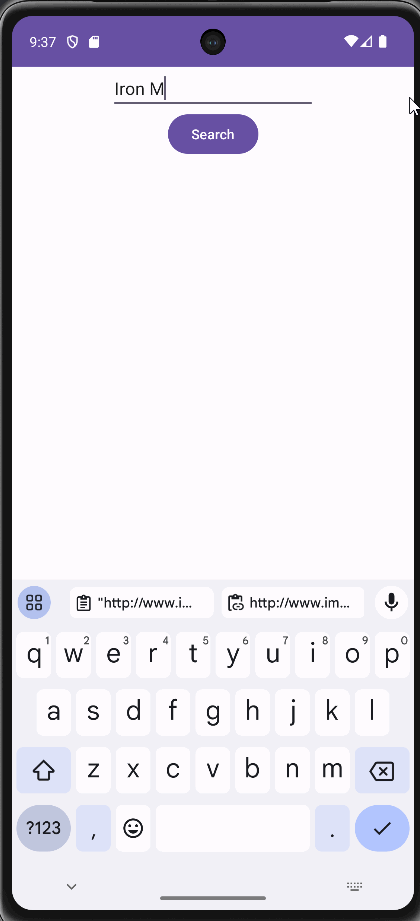

# Project 8: Movie Search App

An Android app that searches movies from IMDb, for C323 Android Mobile Development.

## Functionality 

The following **required** functionality is completed:

* [ ] User can type the name of a movie and search for it
* [ ] App displays movie poster image, name, rating, release date, and review score
* [ ] User can click a button to visit the movie's IMDb page
* [ ] User can click a button to share the movie name and page
* [ ] User can click a button that automatically drafts a feedback email

The following **extensions** are implemented:

* I didn't implement any extensions for this project.

## Video Walkthrough

Here's a walkthrough of implemented user stories:

GIF created with [LiceCap](http://www.cockos.com/licecap/).

## Notes

I used the example Yelp model as a template for getting the API data from IMDb.

## License

    Copyright [2023] [Billy Moore]

    Licensed under the Apache License, Version 2.0 (the "License")
    you may not use this file except in compliance with the License.
    You may obtain a copy of the License at

        http://www.apache.org/licenses/LICENSE-2.0

    Unless required by applicable law or agreed to in writing, software
    distributed under the License is distributed on an "AS IS" BASIS,
    WITHOUT WARRANTIES OR CONDITIONS OF ANY KIND, either express or implied.
    See the License for the specific language governing permissions and
    limitations under the License.
